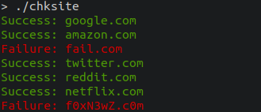
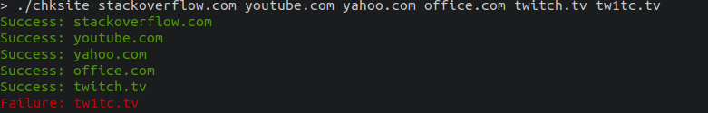

# Site Connectivity Checker

This program aims to check the status of any server, by pinging it.
If the server requested responds, then it is marked as successful and reported as such.
Otherwise, the ping request will timeout and the interaction will be marked a failure.

## Usage

`./chksite [sites]`

**Check-Site** may be used to query a provided list of sites, or use the default list.
If a site responds successfully to a ping request, then it will be reported successful.
Otherwise, the interaction will timeout and be considered a failure.

### Examples

